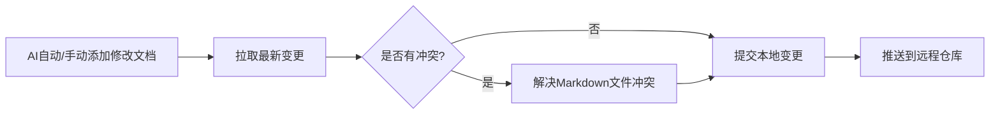

<div align="center">

# kb-mcp-lite
**面向AI代理的轻量级本地知识库 · 团队协作友好**

`pip install kb-mcp-lite` — 让任何AI编程助手都拥有结构化、可查询、可同步的团队"第二大脑"

[](https://pypi.org/project/kb-mcp-lite/)
[](https://www.python.org/)
[](./LICENSE)
[](https://modelcontextprotocol.io/)
[](#状态说明)

</div>

---

## 🎯 解决什么问题
当前的知识管理工具存在明显的断层：
- 面向人类的知识库（Notion/Obsidian）：需要手动维护，AI无法直接高效访问
- 向量数据库：需要复杂配置，没有结构化Schema，团队协作困难
- 团队文档散落在各个地方：代码注释、Wiki、PR描述、飞书文档，AI找不到也用不了

`kb-mcp-lite` 专门填补这个空白：**专为AI代理设计，同时兼顾人类编辑和团队协作**，让AI编程助手可以直接调用团队沉淀的所有技术知识。

| 对比维度 | Notion/Obsidian | Chroma/LanceDB等向量库 | **kb-mcp-lite** |
|---|---|---|---|
| 服务对象 | 人类 | 模型嵌入 | **AI代理 + 人类开发者** |
| 访问方式 | Web UI | SDK调用 | **MCP标准协议（AI原生） + CLI + Web管理后台** |
| 结构规范 | 自由格式 | 无结构 | **强Schema（标准化文档类型）** |
| 存储方案 | 云服务/私有部署 | 本地文件 | **SQLite + FTS5 单文件存储** |
| 团队协作 | 在线协作 | 无协作能力 | **Git原生同步，纯文本版本管理** |
| 部署成本 | 账号/服务器 | 安装配置 | **`pip install` 开箱即用，零配置** |
| 数据隐私 | 云服务存储 | 本地 | **完全本地存储，无云服务，无遥测** |

---

## ✨ 核心能力详解
### 1. 📐 强Schema标准化与结构化Metadata
内置9种开箱即用的文档类型，覆盖技术团队90%的知识沉淀场景，所有类型支持结构化Typed Metadata并可通过Python子类扩展：
| 文档类型 | ID前缀 | 用途说明 | 结构化Metadata亮点 |
|---|---|---|---|
| `project` | `proj` | 项目/仓库说明文档 | 记录技术栈、负责人、状态、部署流程 |
| `decision` | `dec` | 架构决策记录(ADR) | 结构化记录 `status`(accepted/superseded)、决策人、替代方案 |
| `lesson` | `lesson` | 经验教训/踩坑记录 | 结构化记录 `severity`、根因归类、避坑准则 |
| `glossary` | `glossary` | 术语表 | 统一业务/技术专有名词标准定义 |
| `person` | `person` | 人员档案 | 团队成员技术栈、模块分工与联系方式 |
| `faq` | `faq` | 常见问题 | 沉淀高频问答，消除重复咨询 |
| `api` | `api` | API接口文档 | 结构化记录 HTTP Method、Path、鉴权与限流要求 |
| `runbook` | `runbook` | 运维手册(SOP) | 标准化运维及应急处置步骤 |
| `release` | `release` | 发布日志 | 版本号、变更清单、影响范围与回滚步骤 |

**优势**：
- **真实结构化元数据**：支持 JSON 字段与 Frontmatter 无损互转，AI 可精确抽取与检索事实；
- 自动生成稳定ID（比如 `dec/use-sqlite-fts5`），可被跨文档可靠引用；
- 支持自定义扩展文档类型，满足团队个性化需求。

---

### 2. ⚡ Section 级细粒度切片与 Token 保护
传统知识库全量返回整篇文档极易挤占 Agent 上下文空间，造成 Token 浪费。
- **章节按需获取**：`kb_get(id="...", section="Architecture")` / `kb get --section "..."` 仅提取目标标题章节；
- **智能目录感知**：未指定章节时或章节不存在时，自动返回可用章节目录清单；
- **精准降耗**：将长文档上下文消耗降低 70%~90%。

---

### 3. 🔍 多模式智能搜索
支持三种搜索模式，满足不同场景的查询需求：
- **词法搜索（默认）**：基于SQLite FTS5，BM25排序，精准匹配关键词，适合查找确定的技术点
- **模糊搜索**：基于trigram索引，容错拼写错误、缩写、别名，适合模糊记忆的查询
- **语义搜索（可选）**：安装 `sqlite-vec` 扩展后支持，支持自然语言语义匹配，适合模糊问题查找相关知识

**搜索能力特性**：
- 支持按文档类型、标签过滤
- 自动关联相关文档的反向链接
- 搜索结果返回完整的结构化信息，AI可以直接使用

---

### 4. 📜 完整版本控制与审计
所有文档的增删改操作都会被完整记录：
- 查看任意文档的完整修改历史，每次变更都有版本号
- 支持版本对比，字段级差异展示，清楚知道改了什么
- 支持恢复到任意历史版本，误修改可以一键回滚
- 软删除机制，删除的文档可以随时恢复，不会丢失数据

---

### 5. 🔗 类型化知识图谱
文档之间可以创建带关系的链接：
- 支持自定义关系类型（比如「governs」「relates-to」「depends-on」）
- 自动生成反向链接，查找某个决策影响哪些项目，某个Bug关联哪些经验
- 支持知识图谱可视化（Web管理后台），直观看到知识之间的关联关系
- 链接完整性校验，自动检测失效链接

---

### 6. 🤝 Git原生团队协作 & 智能三方合并
完全基于Git的团队同步机制，学习成本为零：
- **智能元数据合并 (3-Way Merge)**：多人同时修改文档时，对 `tags` / `aliases` / `links` / `metadata` 自动做集合并集合并，杜绝 Git 冲突；
- **自动化文件监听 (Auto-Watcher)**：提供 `kb watch` 命令，本地编辑 Markdown 文件实时增量同步至 SQLite 数据库；
- 数据库文件本地存储，不会提交到Git，每个成员有独立的本地实例；
- 完全兼容现有Git工作流，支持PR评审、分支管理、Code Owner等机制。

---

### 7. 🗄️ 多 Vault 隔离与跨库联合检索
支持创建多个独立的知识库，数据完全隔离且支持 MCP 动态路由：
- 不同项目、不同团队使用独立的vault，互不干扰；
- **跨库联合搜索**：在 MCP 中支持 `kb_search(query="...", vault="*")`，一次调用同时检索全局公共库与当前项目私有库；
- **动态单库切换**：`kb_get(id="...", vault="work")` 无需重启服务，随时精准路由。

---

### 8. 🌐 MCP协议原生支持
完全兼容MCP（Model Context Protocol）标准协议，任何支持MCP的客户端（Claude Desktop、Cursor、Composio等）都可以直接接入，AI自动获得以下能力：
#### 15个内置工具
| 工具名称 | 功能说明 | AI使用场景 |
|---|---|---|
| `kb_search` | 全文搜索 (支持 `vault="*"` 跨库) | AI遇到问题时，先搜索团队知识库有没有相关解决方案 |
| `kb_get` | 获取文档详情 (支持 `section` 提取) | AI按需拉取完整内容或指定章节，节省上下文 Token |
| `kb_add` | 创建新文档 (支持 `metadata`) | AI学习到新知识后，自动沉淀结构化事实到知识库 |
| `kb_update` | 更新现有文档 (支持 `metadata`) | 文档内容过时，AI自动更新补充 |
| `kb_delete` | 软删除文档 | 废弃的文档，AI可以删除 |
| `kb_list` | 按类型/标签/Vault筛选文档 | AI查看所有架构决策、所有项目信息等 |
| `kb_link` | 创建文档之间的链接 | AI发现文档之间的关联关系，自动建立链接 |
| `kb_unlink` | 移除链接 | 关联关系失效时删除 |
| `kb_history` | 查看文档版本历史 | AI想知道某个决策的变更过程 |
| `kb_restore` | 恢复到历史版本 | 误修改后回滚 |
| `kb_diff` | 对比版本差异 | AI查看文档修改了什么内容 |
| `kb_restore_deleted` | 恢复已删除文档 | 误删后恢复 |
| `kb_doctor` | 健康检查 | AI先确认知识库结构和索引是否正常 |
| `kb_similar` | 相似文档推荐 | AI找相关上下文，避免重复沉淀 |
| `kb_duplicates` | 重复文档检测 | AI发现并合并重复知识 |

> 批量导入/导出、`prune`、`reindex`、vault 和 Git 同步属于 CLI/Admin 生命周期能力，不会作为 MCP 文件系统工具暴露。

#### 13个结构化资源
| 资源URI | 返回内容 |
|---|---|
| `kb://doc/{type}/{slug}` | 完整文档信息 |
| `kb://links/{type}/{slug}` | 文档的所有入站和出站链接 |
| `kb://types` | 所有文档类型的列表 |
| `kb://stats` | 知识库统计信息 |
| `kb://graph/{type}/{slug}` | 以该文档为中心的知识图谱 |
| `kb://graph/{type}/{slug}/{depth}` | 指定深度的知识图谱 |
| `kb://list` | 所有文档列表 |
| `kb://list/{type}` | 按类型筛选的文档列表 |
| `kb://changes` | 最近变更记录 |
| `kb://history/{type}/{slug}` | 指定文档的版本历史 |
| `kb://search/{query}` | 搜索结果 |
| `kb://export/{type}/{slug}` | 导出文档为Markdown |
| `kb://help/{doc}` | 帮助文档 |

#### 7个交互Prompt
| Prompt名称 | 用途 |
|---|---|
| `new-doc` | 引导式创建新文档 |
| `link-analysis` | 分析文档链接关系 |
| `search-guide` | 智能搜索助手 |
| `import-docs` | 导入文档指引 |
| `doctor` | 知识库健康检查 |
| `maintenance` | 知识库维护指导 |
| `onboarding` | 新手上手指南 |

---

## 🚀 快速开始使用
### 🔧 安装
```bash
pip install kb-mcp-lite

# 可选安装语义搜索支持（需要SQLite扩展支持）
pip install kb-mcp-lite[vec]
```

### 个人用户基础使用
#### 1. 初始化知识库
```bash
kb init
```
会在默认路径 `~/.local/share/kb-mcp/` 创建默认vault的SQLite数据库。

#### 2. 添加第一个文档
```bash
kb add --type project \
       --title "kb-mcp-lite" \
       --tags "mcp,knowledge-base,python" \
       --body "面向AI代理的轻量级本地知识库，基于SQLite + FTS5 + MCP协议开发。"
```

#### 3. 搜索文档
```bash
# 默认搜索
kb search "MCP 知识库"

# 按类型过滤
kb search "sqlite" --type decision

# 模糊搜索
kb search "ft5" --fuzzy
```

#### 4. 查看已有文档
```bash
# 查看所有文档
kb list

# 按类型过滤
kb list --type lesson

# 按标签过滤
kb list --tags "sqlite,bug"
```

#### 5. 更多CLI命令
```bash
# 查看文档详情（完整）
kb get <文档ID>

# 按章节获取文档内容（仅提取特定标题内容，节省Token）
kb get <文档ID> --section "Architecture"

# 更新文档
kb update <文档ID> --title "新标题"

# 自动监听 Markdown 目录实时增量同步入库
kb watch --interval 1.0

# 删除文档
kb delete <文档ID>

# 查看版本历史
kb history <文档ID>

# 恢复到指定版本
kb restore <文档ID> --version 2

# 启动Web管理后台
kb admin start
```

---

### 👥 团队协作配置
#### 首次配置团队知识库
1. **管理员创建团队Git仓库**（空仓库即可）
2. **管理员本地初始化vault并关联Git**
   ```bash
   # 创建团队vault
   kb vault create team --desc "XX团队公共知识库"
   kb vault switch team
   
   # 克隆团队Git仓库到本地
   git clone <团队Git仓库地址> ~/team-kb
   
   # 关联vault和Git同步目录
   kb vault init-git --sync-dir ~/team-kb
   
   # 导出已有文档到Git目录并提交
   kb vault commit -m "初始化团队知识库"
   kb vault push
   ```

#### 新成员加入
```bash
# 1. 克隆团队知识库Git仓库
git clone <团队Git仓库地址> ~/team-kb

# 2. 创建本地vault
kb vault create team --desc "XX团队公共知识库"
kb vault switch team

# 3. 关联Git同步目录
kb vault init-git --sync-dir ~/team-kb

# 4. 拉取并导入所有文档
kb vault pull
```

#### 日常协作流程


日常操作命令：
```bash
# 写文档前先拉取最新
kb vault pull

# AI添加/修改文档后，提交变更
kb vault commit -m "添加XX项目部署流程文档"

# 推送到远程仓库
kb vault push
```

#### AI工具自动同步配置
如果希望AI调用`kb add`添加文档后自动同步到Git，可以配置post-hook脚本，在`~/.config/kb-mcp/config.yaml`中添加：
```yaml
hooks:
  post_add: "kb vault commit -m 'AI自动添加文档: {doc_title}' && kb vault push"
  post_update: "kb vault commit -m 'AI自动更新文档: {doc_title}' && kb vault push"
```

---

### 🤖 MCP客户端接入配置
#### Claude Desktop 配置
编辑 `~/.config/claude_desktop_config.json` 添加：
```json
{
  "mcpServers": {
    "kb": {
      "command": "kb",
      "args": ["serve"]
    }
  }
}
```
重启Claude后，AI就可以直接访问你的知识库了。

#### Cursor 配置
在Cursor设置中找到MCP服务器配置，添加：
- 名称：`kb`
- 命令：`kb`
- 参数：`["serve"]`

#### 指定使用某个vault
如果有多个vault，可以指定启动时使用的vault：
```json
"args": ["serve", "--vault", "team"]
```

---

### 🔌 高级用法
#### 自定义文档类型
```python
from kb_mcp_lite.schema import Document, Field

class ApiDoc(Document):
    """API接口文档类型"""
    type: str = "api"
    id_prefix: str = "api"
    
    # 自定义字段
    endpoint: str = Field(description="接口路径")
    method: str = Field(description="HTTP方法")
    version: str = Field(description="接口版本")
    
    class Config:
        schema_extra = {
            "example": {
                "title": "用户获取接口",
                "endpoint": "/api/v1/user/{id}",
                "method": "GET",
                "version": "v1",
                "tags": ["user", "api"],
                "body": "接口返回用户的基本信息..."
            }
        }
```
注册后就可以使用 `kb add --type api` 创建这种类型的文档。

#### 批量导入现有Markdown文档
```bash
# 导入目录下所有Markdown文件
kb import ./docs/

# 试运行，查看会导入什么，不实际写入
kb import ./docs/ --dry-run

# 导入后输出JSON格式报告
kb import ./docs/ --json
```
要求Markdown文件顶部包含YAML frontmatter，至少有`type`和`title`字段。

#### 导出知识库
```bash
# 导出所有文档到指定目录
kb export ./export_dir/

# 强制覆盖已有文件
kb export ./export_dir/ --force
```

---

## 💡 最佳实践
### 文档命名与分类规范
1. **标题清晰准确**：用动宾结构或者问题式标题，比如「Redis缓存击穿解决方案」而不是「Redis笔记」
2. **标签统一规范**：所有标签小写，用短横线分隔，比如 `redis-cache`, `bug-fix`
3. **关联关系完整**：创建文档时主动关联相关文档，比如决策记录关联对应的项目，经验教训关联对应的Bug决策
4. **及时更新**：文档过时后及时更新，不要保留错误信息

### 团队协作规范
1. **提交信息规范**：`kb vault commit -m "提交信息"` 要清晰说明修改内容
2. **PR评审机制**：重要文档变更走PR评审，保证知识质量
3. **定期清理**：每个季度运行一次 `kb doctor` 检查知识库健康度，清理失效文档和链接

### AI使用建议
1. 要求AI解决问题前先搜索知识库，优先使用已有方案
2. 解决完新问题后，要求AI自动沉淀到知识库作为经验
3. 定期让AI整理知识库，优化结构、补充关联、更新过时内容

---

## 🛠️ 开发指南
### 本地开发环境搭建
```bash
git clone https://github.com/HelloTomBruce/kb-mcp-lite
cd kb-mcp-lite

# 安装依赖（推荐使用uv）
pip install -e ".[dev,vec]"

# 运行测试
pytest

# 代码检查
ruff check .
mypy src/
```

### 项目结构说明
```
src/kb_mcp_lite/
├── cli.py              # CLI命令入口
├── mcp_server.py       # MCP服务端实现
├── schema.py           # 数据结构和文档类型定义
├── store/              # SQLite存储核心
│   ├── sqlite.py       # 基础SQL操作
│   ├── search.py       # 搜索逻辑
│   ├── versioning.py   # 版本控制
│   ├── embedding.py    # 向量搜索支持
│   └── maintenance.py  # 维护工具
├── md_io.py            # Markdown导入导出
├── vault.py            # 多vault管理
├── admin/              # Web管理后台
├── migrations/         # 数据库迁移脚本
└── config.py           # 配置管理
```

---

## 🗺️ 路线图
| 版本 | 功能范围 | 状态 |
|---|---|---|
| v0.1.0 | CLI + MCP服务 + SQLite/FTS5 + 6种基础文档类型 | ✅ 已发布 |
| v0.2.0 | 模糊搜索 + 语义搜索支持 + 命令补全 | ✅ 已发布 |
| v0.3.0 | MCP资源和Prompt支持 + 版本控制 + 别名 | ✅ 已发布 |
| v0.4.0 | 多vault支持 + Git同步 + vault管理命令 | ✅ 已发布 |
| v0.5.0 | CLI重构 + 3种新文档类型 + 项目筛选 + 增强健康检查 | ✅ 已发布 |
| v0.6.0 | 插件系统 + 外部同步（Notion/GitHub/飞书） | 📋 规划中 |
| v1.0.0 | PostgreSQL后端支持 + 多用户权限 + 托管模式 | 📋 规划中 |

---

## 📌 状态说明
当前处于**Beta测试阶段**：
- API和存储格式从v0.5.0开始已经稳定，不会有破坏性变更
- 生产环境使用建议锁定版本：`kb-mcp-lite>=0.5,<0.6`
- 欢迎提交Issue和PR，贡献代码请查看 [CONTRIBUTING.md](./CONTRIBUTING.md)

---

## 📄 许可证
MIT License，可自由使用、修改、分发，保留版权声明即可。
